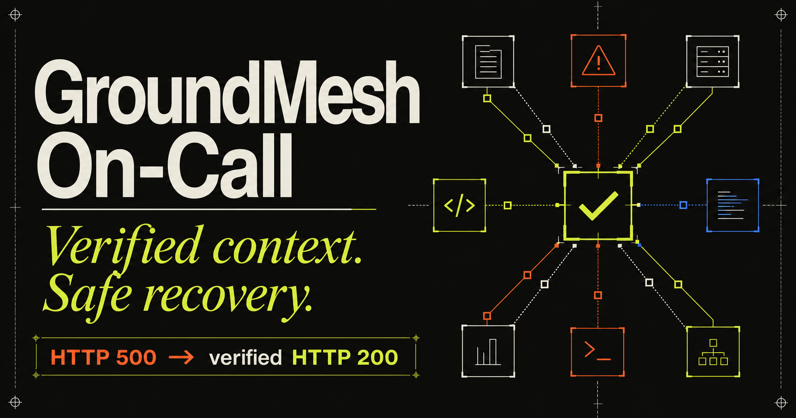
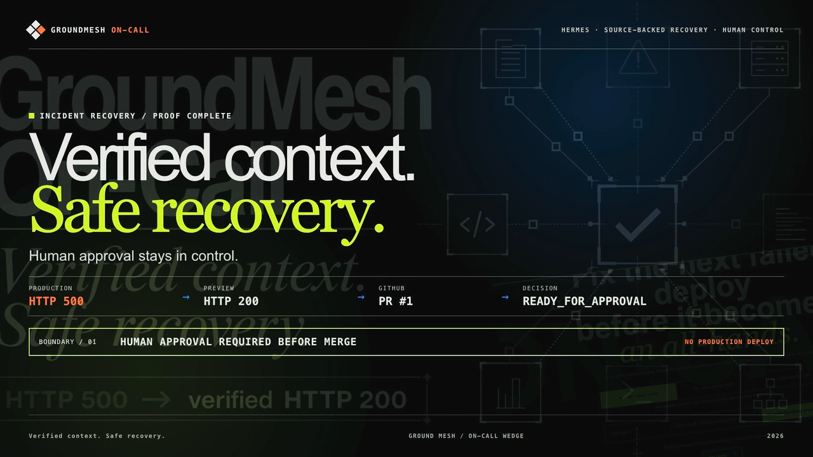
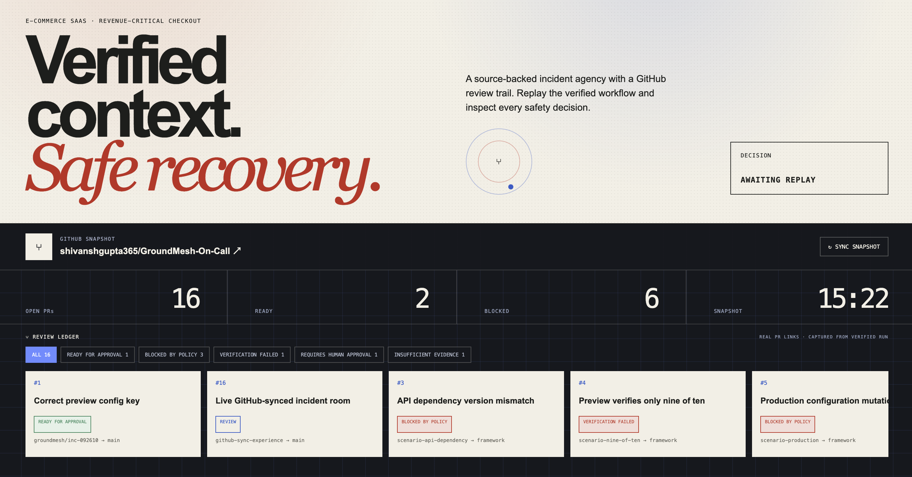
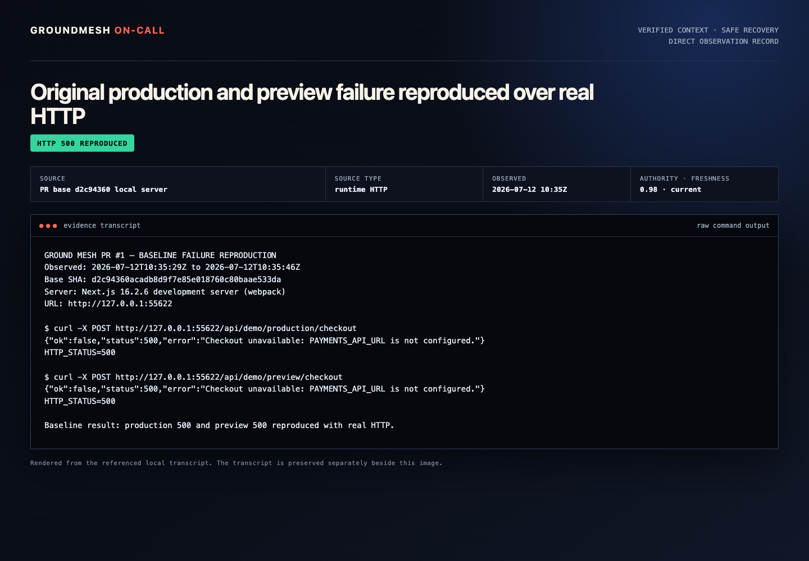
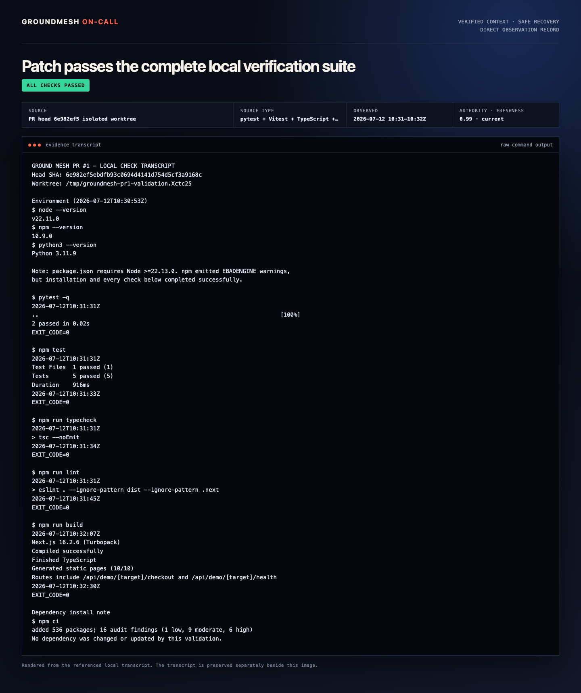
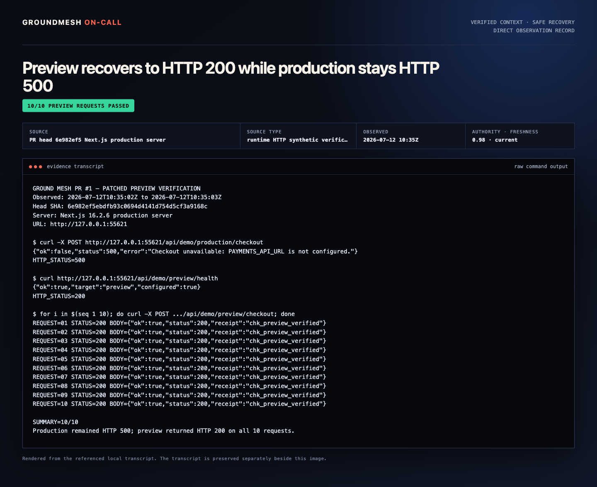
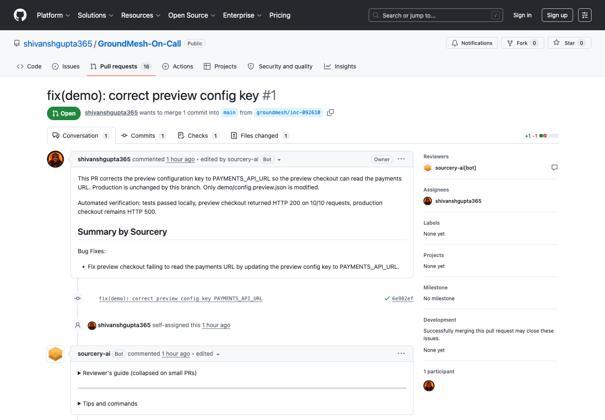
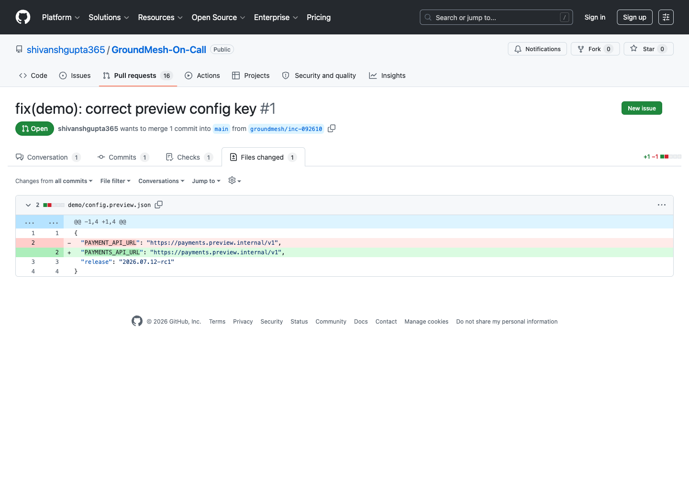
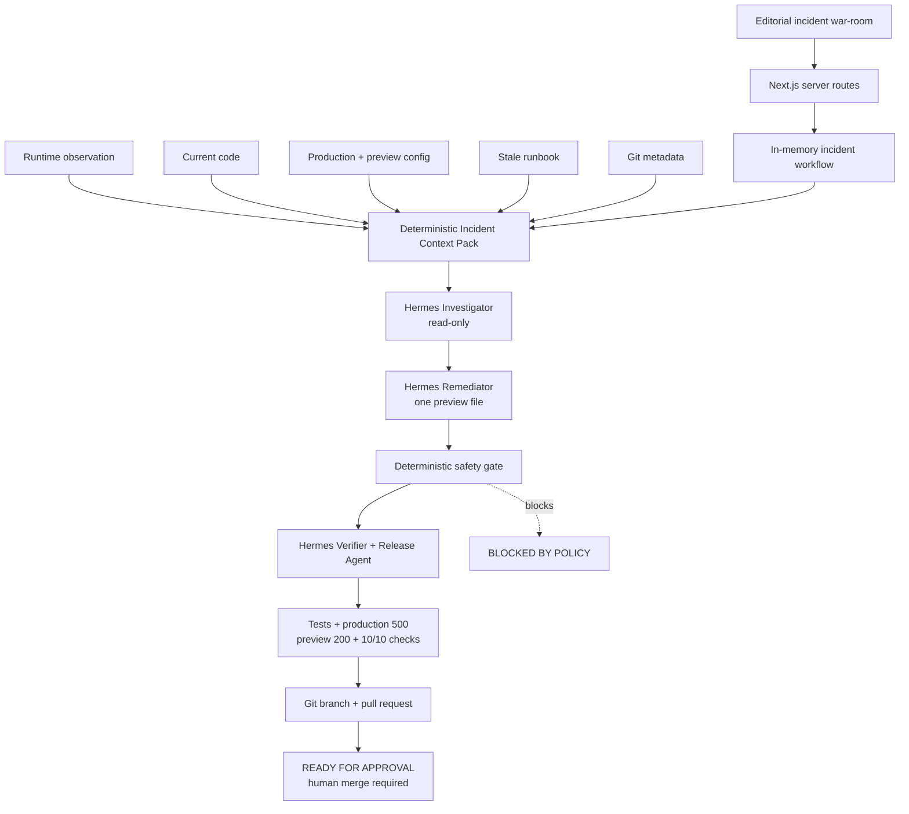

# GroundMesh On-Call



**Verified context. Safe recovery.**

[](#built-for-hermes-buildathon-bangalore)
[](#architecture)
[](#safety-invariants)
[](./LICENSE)

GroundMesh On-Call is a Hermes-powered Tier-1 failed-deployment response agency for small SaaS and e-commerce engineering teams. It turns live operational evidence into a source-backed Incident Context Pack, coordinates three narrowly bounded specialist agents, verifies a preview-only recovery, and prepares a real GitHub pull request for human approval.

> Built solo at the **World's Largest Hermes Buildathon, Bangalore** for the **AI as Agency** track.

## Product demo

[](https://raw.githubusercontent.com/shivanshgupta365/GroundMesh-On-Call/main/docs/product-demo/groundmesh-oncall-demo.mp4)

**[▶ Play the 47-second product demo with sound](https://raw.githubusercontent.com/shivanshgupta365/GroundMesh-On-Call/main/docs/product-demo/groundmesh-oncall-demo.mp4)**

## The problem

When a release breaks a revenue-critical workflow, the engineer on call must reconcile runtime behavior, source code, deployment configuration, recent Git changes, and documentation—often while those sources disagree. A generic coding agent can suggest a patch; it does not establish which evidence is current, whether the action is allowed, or whether the recovery was actually proved.

GroundMesh makes evidence quality and action safety part of the workflow itself.

## Buildathon proof

```text
production checkout 500
        ↓
verified Context Pack with source authority + freshness
        ↓
Hermes Investigator → Remediator → Verifier
        ↓
one-file preview remediation + deterministic policy PASS
        ↓
production 500 · preview 200 · 10/10 live checks
        ↓
real GitHub pull request · READY FOR APPROVAL
```

Production remains unchanged. GroundMesh never automatically merges or deploys.

## Product Usage Proof

These direct-observation records show the real vertical slice running end to end. Select any image to inspect the full-resolution evidence.

<table>
  <tr>
    <td width="50%" valign="top">
      <a href="./docs/product-usage/01-real-github-incident-room.png">
        
      </a>
      <br>
      <strong>1 · Live incident room</strong><br>
      The GitHub-synced review ledger exposes real incident outcomes, policy blocks, and approval state.
    </td>
    <td width="50%" valign="top">
      <a href="./docs/product-usage/02-real-http-500.png">
        
      </a>
      <br>
      <strong>2 · Failure reproduced</strong><br>
      Production and preview both return HTTP 500 over real requests.
    </td>
  </tr>
  <tr>
    <td width="50%" valign="top">
      <a href="./docs/product-usage/03-real-tests-and-build.png">
        
      </a>
      <br>
      <strong>3 · Verification suite passed</strong><br>
      Pytest, Vitest, TypeScript, lint, and the production build complete successfully.
    </td>
    <td width="50%" valign="top">
      <a href="./docs/product-usage/04-real-http-200-10x.png">
        
      </a>
      <br>
      <strong>4 · Preview recovery proved</strong><br>
      Preview returns HTTP 200 on 10/10 requests while production remains HTTP 500.
    </td>
  </tr>
  <tr>
    <td width="50%" valign="top">
      <a href="./docs/product-usage/05-real-github-pr.png">
        
      </a>
      <br>
      <strong>5 · Real pull request created</strong><br>
      GitHub shows the live remediation PR, one commit, one changed file, and automated review evidence.
    </td>
    <td width="50%" valign="top">
      <a href="./docs/product-usage/06-real-one-file-diff.png">
        
      </a>
      <br>
      <strong>6 · One-file change inspected</strong><br>
      The Files changed view confirms the bounded preview configuration correction and no production edit.
    </td>
  </tr>
</table>

## Demonstrated use case

The buildathon vertical slice models a failed checkout deployment:

- Current checkout code requires `PAYMENTS_API_URL`.
- Deployment configuration and a stale runbook use `PAYMENT_API_URL`.
- GroundMesh reproduces the HTTP 500, gathers current evidence, and detects the conflict.
- The Investigator cites the source IDs supporting the diagnosis without modifying files.
- The Remediator may correct only `demo/config.preview.json`.
- The deterministic safety gate validates scope, evidence confidence, production integrity, and secret/destructive-pattern rules.
- The Verifier proves production is still 500, preview is 200, and 10/10 real preview requests pass before opening a pull request.

## Use cases within the vertical slice

| User need | GroundMesh response |
| --- | --- |
| Triage a failed checkout release | Reproduces the failure and assembles runtime, code, configuration, runbook, and Git evidence. |
| Resolve conflicting operational guidance | Scores source authority and freshness, marks the stale runbook, and explains the authoritative value. |
| Prepare the smallest safe recovery | Restricts remediation to one allowlisted preview configuration file. |
| Block an unsafe emergency workaround | Rejects production edits, secret-like values, destructive patterns, broad diffs, and low-confidence action. |
| Hand off an incident for approval | Packages the evidence, diff, policy result, tests, HTTP checks, and pull-request link for a human reviewer. |

The primary user is an on-call engineer or technical founder. The economic buyer is a CTO, Head of Engineering, Platform Lead, DevOps Lead, or Engineering Manager at a GitHub-based team without full overnight SRE coverage.

## Architecture



### Core components

| Layer | Responsibility |
| --- | --- |
| Incident war-room | Shows service pulse, evidence-backed timeline, Context Pack sources, conflict resolution, policy, checks, diff, and GitHub review state. |
| Server-only coordination | Owns incident state, polls real workflow progress, and keeps Hermes credentials out of the browser. |
| Context Pack | Records source IDs, type, observation time, authority, freshness, fingerprint, and redacted excerpt for every claim. |
| Hermes specialist crew | Runs the Investigator, Remediator, and Verifier sequentially with role-specific permissions and validated structured results. |
| Deterministic policy | Decides whether the proposed action is safe independently of model output. |
| Verification and release | Runs tests and HTTP probes, creates the incident branch and commit, and opens a pull request without merging it. |
| GitHub review surface | Syncs repository metadata and open pull requests into the incident room for mentor and reviewer visibility. |

## Safety invariants

The remediation passes only when all of the following remain true:

- Exactly one file changed: `demo/config.preview.json`.
- Production configuration is byte-for-byte unchanged.
- Investigation confidence is at least `0.85`.
- No secret-like value appears in the patch.
- No destructive command or database operation appears in the patch.
- Production checkout still returns HTTP 500.
- Preview checkout returns HTTP 200 on all ten verification requests.
- A human must approve any merge or production action.

Any malformed Hermes result, insufficient evidence, policy failure, test failure, unhealthy preview, or unverifiable pull-request URL becomes an explicit `FAILED` or `BLOCKED` result—never simulated success.

## Agent responsibilities

1. **Investigator** — reproduces the failure, inspects the grounded sources, cites source IDs, resolves the stale-context conflict, and changes nothing.
2. **Remediator** — creates a dedicated incident branch and applies only the bounded preview configuration correction.
3. **Verifier and Release Agent** — independently runs tests and real HTTP checks, confirms production integrity, commits only the allowed file, pushes the branch, and opens the review-ready pull request.

## Repository map

| Path | Purpose |
| --- | --- |
| `app/` | Incident-room interface and server API routes. |
| `lib/context-pack.ts` | Source collection, scoring, redaction, fingerprints, claims, and conflict construction. |
| `lib/incidents.ts` | Sequential incident orchestration and in-memory workflow state. |
| `lib/hermes.ts` | Server-only Hermes Runs API and local Hermes adapter. |
| `lib/policy.ts` | Deterministic action-safety gate. |
| `demo/` | Deterministic checkout service and production/preview configurations. |
| `runbooks/` | Deliberately stale operational guidance used to prove conflict handling. |
| `tests/` | Failure, recovery, Context Pack, redaction, and policy-boundary tests. |

## What judges can verify

- A real, deterministic checkout failure—not a mocked status card.
- Source-backed claims with visible authority, freshness, and conflict resolution.
- Three distinct Hermes roles performing bounded work in sequence.
- A one-file preview correction while production stays broken and untouched.
- Deterministic allow and block decisions independent of model judgment.
- Ten successful live preview requests and a real GitHub pull request.
- A clear human approval boundary before production.

## Built for Hermes Buildathon Bangalore

GroundMesh On-Call was designed and built solo by **Shivansh Gupta** at the **World's Largest Hermes Buildathon, Bangalore**. The project focuses on one complete, judge-verifiable agency workflow rather than a broad collection of simulated incident types.

| | |
| --- | --- |
| **Track** | AI as Agency |
| **Product** | GroundMesh On-Call |
| **Tagline** | Verified context. Safe recovery. |
| **Final decision** | `READY FOR APPROVAL` only after every evidence, policy, test, HTTP, and GitHub gate succeeds. |

## License

Copyright 2026 Shivansh Gupta.

Licensed under the [Apache License, Version 2.0](./LICENSE).
